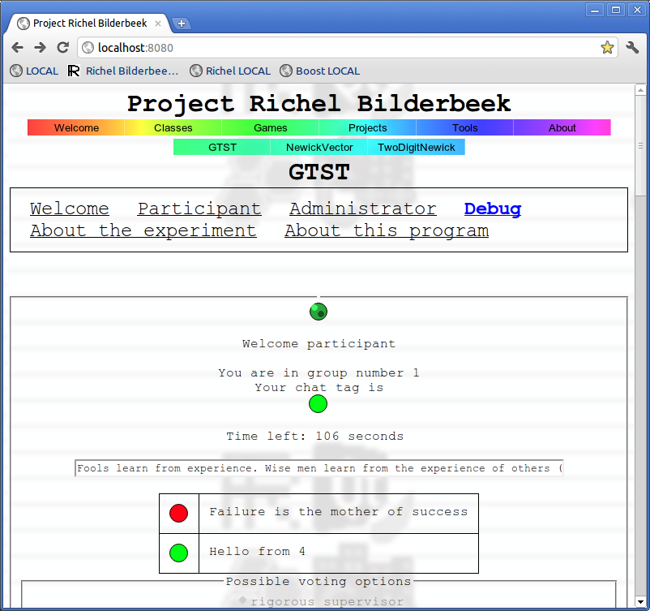

# GTST

[GTST](ProjectGtst.htm) ('Game Theory ServerT') is an open source
program for performing game theory experiments. When
[GTST](ProjectGtst.htm) is started on a server, both administrators and
participants can log in and do game theory experiments.

[GTST](ProjectGtst.htm) has been developed by (sorted alphabetically on
first name):

-   [Lucas
    Molleman](http://www.rug.nl/biologie/onderzoek/onderzoekgroepen/theoreticalbiology/peoplePages/molleman):
    researcher
-   [Piet van den
    Berg](http://www.rug.nl/biologie/onderzoek/onderzoekgroepen/theoreticalbiology/peoplePages/vdBerg):
    researcher
-   [Richel Bilderbeek](http://www.richelbilderbeek.nl): programming

[GTST](ProjectGtst.htm) started on the 9th of May 2011 and formally
ended at the 27th of May 2011.

## The name GTST explained

The name GTST developed from the following steps:

-   The project is about game theory and has 'ProjectGameTheory' as a
    working title, so a name with 'Game Theory' in it would be nice
-   The project is about setting up a server, so a name with 'Server' in
    it would be nice
-   A short name would be nice, so 'GTS' was a possibility
-   GTST is also an abbreviation of [Goede Tijden, Slechte
    Tijden](http://en.wikipedia.org/wiki/Goede_Tijden,_Slechte_Tijden)
    ('Good Times, Bad Times), which is a Dutch soap series. In soap
    series, people often struggle with non-contributors. Problem was:
    what would the 'T' mean?
-   Appending a noun with a 'T' is a certain Dutch slang, resulting in
    'Game Theory ServerT'

## Similar software

-   [z-Tree](http://www.iew.uzh.ch/ztree/index.php): closed source
